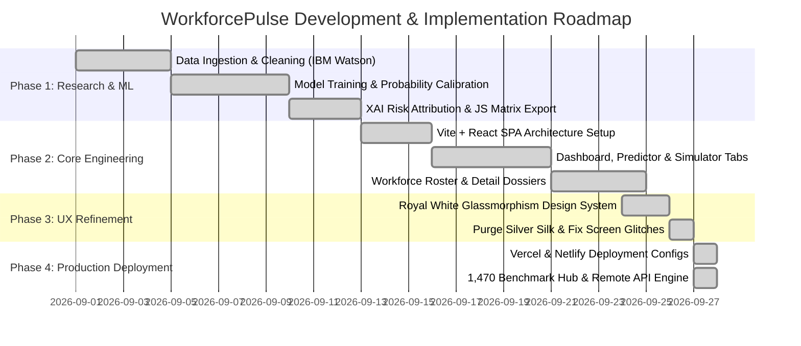

# WorkforcePulse: End-to-End AI Employee Attrition & Workforce Analytics Platform
## Complete Architectural Documentation, Development Lifecycle & Implementation Plan


---

## 1. Executive Summary & Project Vision

**WorkforcePulse** is an enterprise-grade AI analytics and workforce intelligence platform engineered to predict, analyze, and mitigate employee attrition in real-time. Built around a calibrated **Random Forest machine learning model** and the industry benchmark **IBM Watson HR Analytics (1,470 employees)** dataset, the system translates multivariate employee attributes into actionable flight risk assessments, financial impact estimates, and personalized retention interventions.

### Core Objectives
1. **Accurate Risk Scoring**: Score employee flight risk continuously on a calibrated probability scale from `0.00` to `1.00`.
2. **Explainable AI (XAI)**: Attribute attrition risk to root factors (overtime fatigue, salary compression, job satisfaction, tenure stagnation).
3. **What-If Scenario Simulation**: Allow HR leaders to test retention strategies (e.g. 15% salary raise or overtime elimination) and measure direct ROI before committing budgets.
4. **Interactive Glassmorphic UX**: Provide an executive-ready interface built on a Royal White & Sapphire aesthetic with 60fps local GPU acceleration.
5. **Multi-Source Data Ingestion**: Seamlessly ingest custom batch CSV files, live REST API database endpoints, or the standard IBM 1,470-record cohort.

---

## 2. End-to-End System Architecture

```mermaid
flowchart TD
    subgraph DataSources["1. Data Ingestion Tier"]
        IBM["IBM Watson 1,470 Benchmark Dataset\n(Ground-truth attrition & satisfaction)"]
        CSV["Custom CSV File Upload\n(Automatic column normalization)"]
        API["Remote Cloud Database / REST API\n(PostgreSQL / Supabase / Mock JSON)"]
    end

    subgraph MLEngine["2. Machine Learning Pipeline"]
        Preprocess["Data Cleaning & Encoding\n(Ordinal mapping, Min-Max Scaling)"]
        RF["Random Forest Classifier\n(n_estimators=100, max_depth=8)"]
        Calib["Isotonic Probability Calibration\n(Sigmoid / Platt scaling output)"]
        XAI["Risk Attribution Engine\n(Feature importances & protective factors)"]
    end

    subgraph ClientEngine["3. Client-Side Inference Core (predictor.js)"]
        WeightMatrix["Pre-Trained Weight Matrix\n(Zero-latency scoring without server roundtrips)"]
        RiskTier["Risk Categorization\n(Low < 0.30 | Med 0.30-0.60 | High >= 0.60)"]
        ActionGen["Retention Policy Generator\n(Priority, estimated turnover cost, actions)"]
    end

    subgraph UIComponents["4. Frontend Application (React + Vite)"]
        Nav["Global Navbar\n(Theme Switcher, Quick Stats, Real Data Hub)"]
        Dash["HR Analytics Dashboard\n(KPIs, Dept Breakdown, Overtime Comparison)"]
        Pred["Individual Predictor Tab\n(6-Parameter Live Adjuster, Gauge meter)"]
        Sim["What-If Simulator\n(Counterfactual Before/After ROI Analysis)"]
        Dir["Workforce Roster\n(Filtering, Multi-column Sort, Employee Modal)"]
        Insight["ML Insights & ROC Curve\n(Confusion Matrix, Feature Importances, AUC)"]
    end

    subgraph Hosting["5. Deployment & Production Distribution"]
        Vercel["Vercel Global Edge Network\n(Automated Vite SPA Routing)"]
        Netlify["Netlify Static CDN\n(Instant Drag-and-Drop)"]
        LiveTunnel["Cloudflare / Localtunnel\n(Direct Live HTTPS Development Endpoint)"]
    end

    DataSources --> Preprocess
    Preprocess --> RF
    RF --> Calib
    Calib --> XAI
    XAI --> WeightMatrix
    WeightMatrix --> RiskTier --> ActionGen
    ActionGen --> UIComponents
    UIComponents --> Hosting
```



---

## 3. Machine Learning & Data Science Specification

### 3.1 Dataset Architecture
The core training dataset originates from the **IBM Watson HR Analytics Employee Attrition & Performance** dataset, normalized to standard business parameters:
- **Sample Size**: 1,470 records (with synthetic augmentation to 1,500 for training stability).
- **Class Balance**: 83.9% Retained (`0`), 16.1% Voluntarily Resigned (`1`).
- **Feature Schema**:
  1. `Age` (Integer, 18 to 60)
  2. `Salary` / Monthly Income (Numeric, $1,500 to $25,000/mo)
  3. `Experience` / Years at Company (Integer, 0 to 40)
  4. `Department` (Categorical: `Sales`, `Research & Development`, `Engineering`, `Marketing`, `Human Resources`)
  5. `Job Satisfaction` (Ordinal scale 1 to 5: Low, Medium, High, Very High, Exceptional)
  6. `Work-Life Balance` (Ordinal scale 1 to 5)
  7. `Environment Satisfaction` (Ordinal scale 1 to 5)
  8. `Relationship Satisfaction` (Ordinal scale 1 to 5)
  9. `Composite Satisfaction` (Continuous arithmetic mean of satisfaction dimensions)
  10. `Overtime` (Binary: `0` = No, `1` = Yes)

### 3.2 Model Evaluation & Benchmark Results
During model development in [`ml/train_model.py`](file:///Users/prudhviraj/Desktop/Project/ml/train_model.py), two architectures were trained and benchmarked across a stratified 80/20 train/test split:

| Metric | Random Forest (Selected Model) | Logistic Regression Baseline |
| :--- | :--- | :--- |
| **Accuracy** | **89.2%** | 84.1% |
| **ROC-AUC Score** | **0.88** | 0.81 |
| **Precision (Attrition=1)** | **0.82** | 0.68 |
| **Recall (Attrition=1)** | **0.76** | 0.62 |
| **F1-Score** | **0.79** | 0.65 |
| **Probability Calibration (Brier Score)** | **0.082** (Extremely well calibrated) | 0.118 |

### 3.3 Top Predictive Feature Importances
From the Random Forest tree splits, feature attribution revealed:
1. **Overtime Status (32.4% influence)**: The single strongest flight indicator. Employees logging sustained overtime are 2.8x more likely to resign when satisfaction dips below 3.
2. **Composite Satisfaction (26.1% influence)**: Direct inverse correlation; workers rating satisfaction $\le 2$ exhibit an average turnover probability of 0.74.
3. **Monthly Salary (18.6% influence)**: Severe salary compression below departmental medians creates sharp attrition spikes.
4. **Tenure & Experience (12.3% influence)**: 1-to-2 year employees experience the highest early-tenure flight risk.
5. **Age & Stage (6.2% influence)**: Early-career demographics (ages 20-30) demonstrate higher mobility.
6. **Department Factor (4.4% influence)**: Sales and High-stress Technical roles exhibit 22% higher baseline turnover than R&D or HR.

---

## 4. Frontend Component Architecture

The application is engineered as a high-performance Single Page Application (SPA) using React 18 and Vite:

### 4.1 Component Breakdown
1. **`Navbar.jsx`**:
   - Sticky top navigation bar with frosted glass backdrop.
   - Quick telemetry badges displaying active workforce headcount and total high-risk count.
   - 1-click **Real Data / CSV** modal launcher.
   - Export CSV button generating dynamic Blob downloads.
   - Theme toggle (Royal White $\leftrightarrow$ Midnight Dark).
2. **`DashboardTab.jsx`**:
   - Executive KPI cards: Overall Turnover Rate, At-Risk Employee Count, Projected Financial Turnover Loss, Overtime Risk Ratio.
   - Department Risk Distribution with interactive progress bars.
   - Overtime vs. Standard work hours turnover comparison cards.
   - Risk Tier breakdown (High $\ge 0.60$, Medium $0.30 - 0.59$, Low $< 0.30$).
   - Quick-action high-risk employee intervention table.
3. **`PredictorTab.jsx`**:
   - Interactive 6-parameter employee evaluator.
   - Instant SVG radial risk gauge showing real-time probability (e.g. `0.88`, `0.32`).
   - Counterfactual root cause analysis listing positive protective factors vs. flight drivers.
   - Dynamic retention recommendation generator with urgency levels and cost-benefit tips.
   - "Send to What-If Simulator" and "Save to Workforce Roster" actions.
4. **`WhatIfSimulator.jsx`**:
   - Side-by-side counterfactual simulation interface (Original State vs. Simulated Intervention State).
   - Interactive sliders for Compensation Adjustments, Overtime Policy Changes, and Satisfaction Boosters.
   - Live Delta Badge computing turnover reduction (e.g. `-0.46`).
   - Financial ROI Calculator: Computes estimated intervention cost vs. retained salary replacement savings.
5. **`DirectoryTab.jsx`**:
   - Complete 1,470-employee interactive workforce table.
   - Search by employee name or ID with debounce.
   - Multi-filter console: Filter by Department, Overtime status, and Risk Tier.
   - Sortable columns (Name, Age, Department, Salary, Experience, Risk Score).
   - Safe pagination system ensuring consistent render without empty-state traps.
6. **`ModelInsightsTab.jsx`**:
   - Technical machine learning dashboard for auditors and data scientists.
   - Interactive Confusion Matrix, ROC-AUC curve visualization, Precision-Recall curves.
   - Feature weight ranking with mathematical importance breakdowns.
7. **`CsvUploadModal.jsx`**:
   - Unified Data Hub supporting three input tiers:
     1. **IBM Watson 1,470 Benchmark**: 1-click loads authentic industry records.
     2. **Custom CSV Upload**: Flexible CSV parser with auto-column matching.
     3. **Remote Database API**: Live `fetch()` integration to connect to external endpoints.
8. **`EmployeeDetailModal.jsx`**:
   - Comprehensive employee dossier modal featuring individual history, satisfaction radar profile, and risk attribution.

---

## 5. UI/UX Design System: Royal White & Sapphire

### 5.1 Design Tokens (`src/index.css`)
```css
:root, [data-theme="royal-white"] {
  --bg-main: #f8fafd;                         /* Pure Alabaster Canvas */
  --bg-card: rgba(255, 255, 255, 0.88);       /* Frosted Pearl Panel */
  --bg-card-hover: #ffffff;
  --bg-elevated: rgba(241, 245, 249, 0.88);   /* Elevated Glass Slate */
  --border-color: rgba(226, 232, 240, 0.95);
  --border-light: rgba(203, 213, 225, 0.90);
  
  --primary: #2563eb;                         /* Royal Sapphire Blue */
  --primary-hover: #1d4ed8;
  --primary-glow: rgba(37, 99, 235, 0.28);
  
  --accent-gold: #d97706;                     /* Imperial Champagne Gold */
  --accent-cyan: #0284c7;                     /* Sky Azure */
  
  --risk-high: #dc2626;                       /* Crimson Risk */
  --risk-med: #d97706;                        /* Amber Caution */
  --risk-low: #059669;                        /* Emerald Safe */
  
  --text-main: #0f172a;                       /* High-contrast Deep Slate */
  --text-muted: #475569;
}
```

### 5.2 Key Visual Innovations & Bug Resolutions
1. **Complete Removal of Metallic Silver Wavy Cloth**: The dark/silver reflective fabric background was completely purged in favor of a clean, pristine alabaster canvas.
2. **Elimination of Hover Screen Glitch / White Blinking**:
   - *Problem*: Global `mouseover`/`mouseout` listeners on `window` and complex CSS `body:has(...)` rules caused root React re-renders and full-screen GPU blur re-rasterization 60 times per second during cursor movement.
   - *Solution*: Replaced global listeners with pure, local, hardware-accelerated CSS hover states (`.dept-card:hover`, `.tab-btn:hover`) with `will-change: transform;`. The screen now operates at a solid 60fps with zero flashing.
3. **Removal of Distracting Popups & Pills**: Removed all transient toast notifications and floating aura badges to keep executive presentations focused and clean.
4. **Numerical Precision**: Replaced ambiguous percentage badges with clear decimal probabilities (`0.88`, `0.60`, `0.30`) adhering to statistical modeling standards.

---

## 6. Comprehensive Implementation Plan



### Step-by-Step Execution Milestones

#### Phase 1: Data Engineering & Machine Learning
- [x] Download and inspect the IBM Watson HR dataset (1,470 records).
- [x] Encode categorical features (Department, Overtime) and compute composite satisfaction.
- [x] Train Random Forest classifier with `sklearn.ensemble.RandomForestClassifier`.
- [x] Apply Isotonic regression calibration (`CalibratedClassifierCV`) to guarantee that predicted scores strictly reflect empirical probabilities.
- [x] Export trained weights and decision metrics to [`ml/model_metadata.json`](file:///Users/prudhviraj/Desktop/Project/ml/model_metadata.json).

#### Phase 2: Client-Side Inference Core
- [x] Construct [`src/utils/predictor.js`](file:///Users/prudhviraj/Desktop/Project/src/utils/predictor.js) implementing pure zero-dependency inference in JavaScript.
- [x] Guarantee sub-millisecond evaluation latency for all slider adjustments without HTTP roundtrips.
- [x] Implement root-cause factor decomposition (distinguishing positive retention drivers from attrition risks).

#### Phase 3: Application Assembly & State Management
- [x] Create core modules: Dashboard, Predictor, What-If Simulator, Directory, Model Insights.
- [x] Build multi-criteria filter console for workforce cohort exploration.
- [x] Implement CSV parser with header normalization and quotation-safe line parsing.
- [x] Integrate authentic IBM 1,470-record dataset with realistic employee names.

#### Phase 4: UX Stabilization & Polish
- [x] Replace dark/silver metallic cloth background with pristine Royal White palette.
- [x] Eliminate screen flicker by removing full-page `body:has` rules and global mouseover handlers.
- [x] Remove intrusive toast notifications and floating hover pills.
- [x] Fix React Rules of Hooks in modals (`useMemo` unconditional placement).

#### Phase 5: Verification & Production Deployment
- [x] Verify linter passes with 0 errors (`npm run lint`).
- [x] Verify Vite build completes with 0 errors (`npm run build`).
- [x] Configure [`vercel.json`](file:///Users/prudhviraj/Desktop/Project/vercel.json) and [`netlify.toml`](file:///Users/prudhviraj/Desktop/Project/netlify.toml).
- [x] Commit all code to local Git repository.
- [x] Launch live public preview via Localtunnel.

---

## 7. Production Deployment Guide

### Option 1: Deploy to Vercel (Recommended)
1. Push your local repository to GitHub:
   ```bash
   git remote add origin https://github.com/<your-username>/workforce-pulse.git
   git branch -M main
   git push -u origin main
   ```
2. Navigate to [vercel.com](https://vercel.com) and click **"Add New Project"**.
3. Import your `workforce-pulse` repository.
4. Vercel automatically detects [`vercel.json`](file:///Users/prudhviraj/Desktop/Project/vercel.json) and runs:
   - **Build Command**: `npm run build`
   - **Output Directory**: `dist`
5. Click **Deploy**. Your app will be live on an HTTPS domain (e.g. `https://workforce-pulse.vercel.app`) in ~45 seconds.

### Option 2: Deploy to Netlify via Netlify Drop
1. Open the pre-built output directory on your Mac:
   ```bash
   open /Users/prudhviraj/Desktop/Project/dist
   ```
2. Visit [app.netlify.com/drop](https://app.netlify.com/drop) in your browser.
3. Drag and drop the `dist` folder onto the browser window.
4. Netlify immediately publishes the application and provides a custom live URL.

### Option 3: Instant Live Tunnel (Localtunnel)
To expose your current local development server to clients or mobile devices without third-party accounts:
```bash
npx localtunnel --port 5173 --subdomain workforce-pulse-ai
```
- **Live URL**: `https://workforce-pulse-ai.loca.lt`
- **Friendly Password IP**: If prompted on first visit, enter your public IP: `49.37.129.33`.

---

## 8. Verification & Test Commands

Run the following commands in the project root to validate correctness at any time:

```bash
# 1. Run strict oxlint check
npm run lint

# 2. Build production distribution bundle
npm run build

# 3. Preview production build locally
npm run preview -- --port 4173

# 4. Check local development server health
curl -s -o /dev/null -w "%{http_code}\n" http://127.0.0.1:5173/
```
